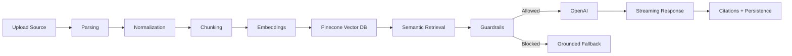

# Lumina

> An AI-powered learning workspace for turning notebooks, documents, videos, and websites into grounded conversations, summaries, roadmaps, and podcasts.


## Overview

Lumina is a production-oriented AI learning workspace where users create notebooks, upload knowledge sources, and interact with them through grounded AI workflows.

Users can add PDFs, YouTube videos, websites, and Markdown files. Lumina parses and chunks source content, creates semantic embeddings, stores vectors in Pinecone, and retrieves relevant context for AI chat, notebook summaries, personalized learning roadmaps, and AI-generated podcasts.

The system is designed around a reusable RAG pipeline with deterministic guardrails before and after retrieval, keeping answers grounded in uploaded sources while preserving a fast streaming chat experience.

## Tech Stack

- **Framework:** Next.js 15, React, TypeScript
- **Styling:** Tailwind CSS
- **Database:** PostgreSQL on Neon with Prisma ORM
- **AI:** OpenAI API, LangChain, RAG, semantic embeddings
- **Vector Search:** Pinecone Vector Database
- **Authentication:** Clerk
- **Runtime & Tooling:** Bun
- **Deployment:** Vercel

## Features

### 📚 Notebook Management

- Create dedicated notebooks for different topics
- Organize multiple sources in a persistent workspace
- Keep notebook state, conversations, roadmaps, and generated podcasts available across sessions

### 📥 Multi-source Ingestion

- PDF uploads
- YouTube video transcript ingestion
- Website ingestion
- Markdown and text-based notes
- Automatic parsing and normalization
- Semantic chunking and embedding generation

### 💬 AI Chat (RAG)

- Grounded answers from uploaded notebook sources
- Source citations alongside answers
- PDF page-aware citations where source metadata is available
- YouTube timestamp citations
- Website citations
- Conversation history for follow-up questions
- Streaming responses for responsive chat UX

### ✨ AI Summary

- Notebook-level summary workflows through the grounded RAG layer
- Sources used for generated answers
- Clickable timestamps, pages, and source references where available

### 🗺 Personalized Learning Roadmaps

- Roadmaps generated from notebook content
- User preferences and learning goals
- Timeline and daily study hour inputs
- Learning style support
- Persistent generated roadmap dashboard
- Task-oriented roadmap structure
- Progress-ready architecture for study tracking

### 🎙 AI Podcast Generator

- Generate podcasts from notebook sources
- Multi-speaker script generation
- Voice selection
- Duration control
- Tone and audience settings
- Transcript generation
- Audio playback
- Persistent podcast library

### 🛡 AI Guardrails

- Prompt injection detection
- Jailbreak detection
- Off-topic query detection
- Prompt length and empty prompt validation
- Retrieval validation before model calls
- Low-confidence rejection
- Grounded fallback responses
- Hallucination reduction through source-only prompting and citation checks
- Centralized reusable guardrail layer for chat, summaries, roadmaps, and podcasts

## Architecture

Lumina uses a retrieval-augmented generation pipeline that separates ingestion, retrieval, safety checks, and model generation. The core design keeps the RAG path reusable across product surfaces while avoiding extra model calls for guardrail decisions.



### RAG Flow

```text
Upload -> Parsing -> Chunking -> Embeddings -> Pinecone -> Semantic Retrieval -> Guardrails -> OpenAI -> Streaming Response
```

### Engineering Decisions

- Deterministic guardrails are dependency-free and run before expensive generation.
- Retrieval quality is validated before calling the LLM.
- Chat preserves streaming while blocked requests return friendly grounded fallbacks.
- Prisma models persist notebooks, sources, conversations, roadmaps, and podcasts.
- Pinecone handles semantic search over source chunks.
- Clerk protects authenticated notebook workspaces.

## Folder Structure

```text
app/                    Next.js App Router pages, API routes, and server actions
components/             Reusable UI and workspace components
components/notebook/    Notebook chat, roadmap, source, and workspace views
components/podcast/     Podcast playback and transcript workspace
lib/ai/                 RAG, embeddings, Pinecone, and guardrail utilities
lib/ingestion/          Source parsing, chunking, and ingestion pipeline
lib/                    Prisma, storage, notebooks, podcasts, and shared utilities
prisma/                 Prisma schema and migrations
public/                 Static assets and screenshot placeholders
types/                  Shared TypeScript declarations
```

## Screenshots

| Area | Preview |
| --- | --- |
| Landing Page |  |
| Dashboard |  |
| Chat |  |
| Summary |  |
| Roadmap |  |
| Podcast |  |

## Installation

### 1. Clone the repository

```bash
git clone https://github.com/your-username/lumina.git
cd lumina
```

### 2. Install dependencies

```bash
bun install
```

### 3. Configure environment variables

Create a `.env` file:

```bash
cp .env.example .env
```

Then fill in the required values listed below.

### 4. Generate Prisma Client

```bash
bunx prisma generate
```

### 5. Apply database migrations

```bash
bunx prisma migrate dev
```

### 6. Run the development server

```bash
bun run dev
```

Open [http://localhost:3000](http://localhost:3000).

## Environment Variables

| Variable | Required | Description |
| --- | --- | --- |
| `DATABASE_URL` | Yes | PostgreSQL connection string, typically from Neon |
| `NEXT_PUBLIC_CLERK_PUBLISHABLE_KEY` | Yes | Clerk publishable key for browser authentication |
| `CLERK_SECRET_KEY` | Yes | Clerk secret key for server authentication |
| `OPENAI_API_KEY` | Yes | OpenAI API key for chat, embeddings, and speech generation |
| `PINECONE_API_KEY` | Yes | Pinecone API key |
| `PINECONE_INDEX_NAME` | Yes | Pinecone index used for source chunk vectors |
| `GOOGLE_GENERATIVE_AI_API_KEY` | Optional | Present for Google AI SDK compatibility if enabled |
| `OPENAI_CHAT_MODEL` | Optional | Overrides the default chat model |
| `OPENAI_EMBEDDING_MODEL` | Optional | Overrides the default embedding model |
| `OPENAI_TTS_MODEL` | Optional | Overrides the default text-to-speech model |
| `UPLOAD_STORAGE_DIR` | Optional | Local upload storage directory override |

## Validation

```bash
bunx tsc --noEmit
bun run lint
bun run build
```

## Future Improvements

- Redis caching for retrieval and generated artifacts
- Flashcard generation from notebook sources
- Quiz generation and spaced repetition
- Mobile-first workspace refinements
- Collaborative notebooks and shared workspaces
- More granular progress tracking for roadmap tasks

## License

MIT
